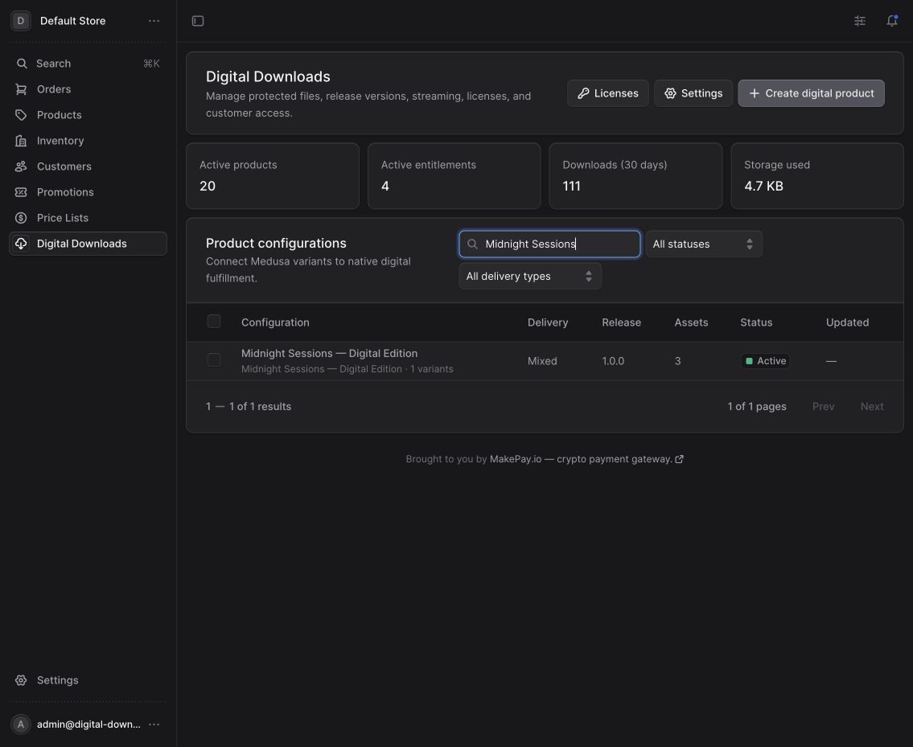
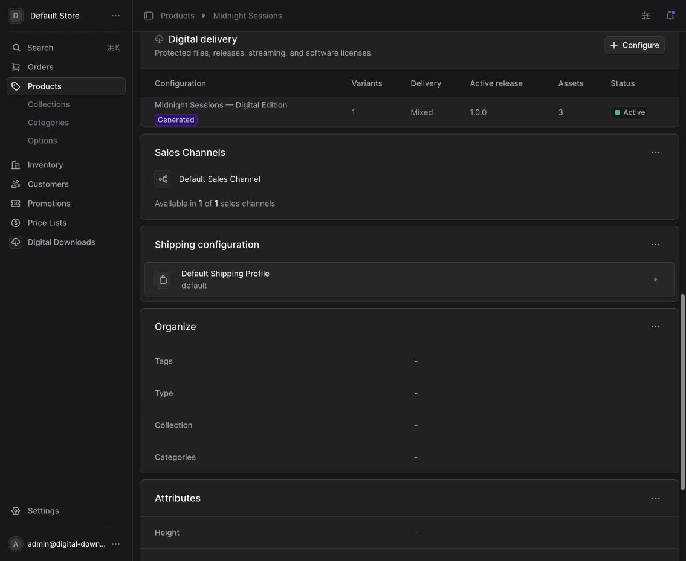
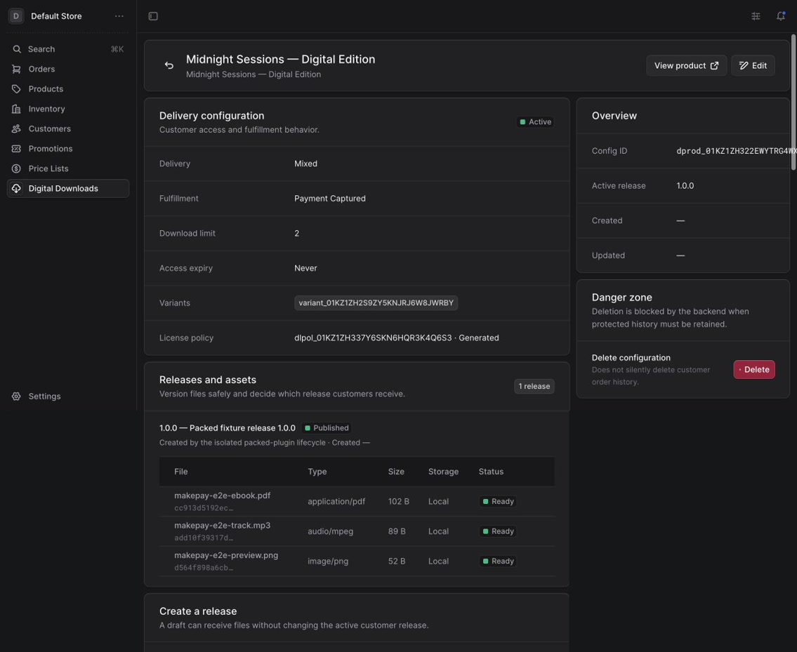
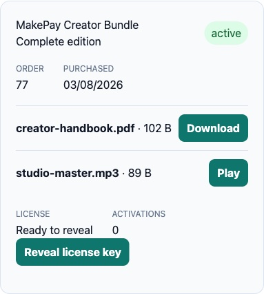
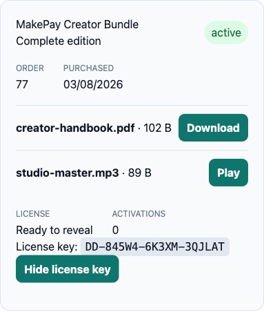
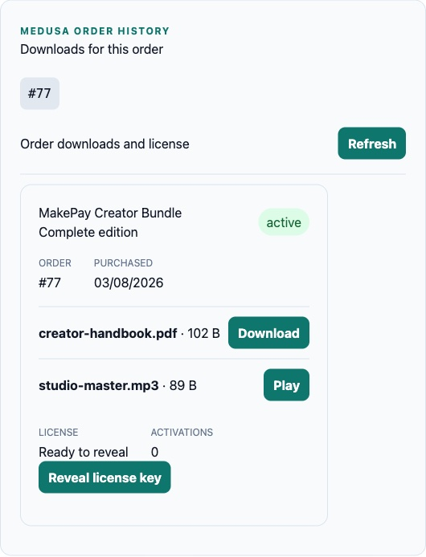
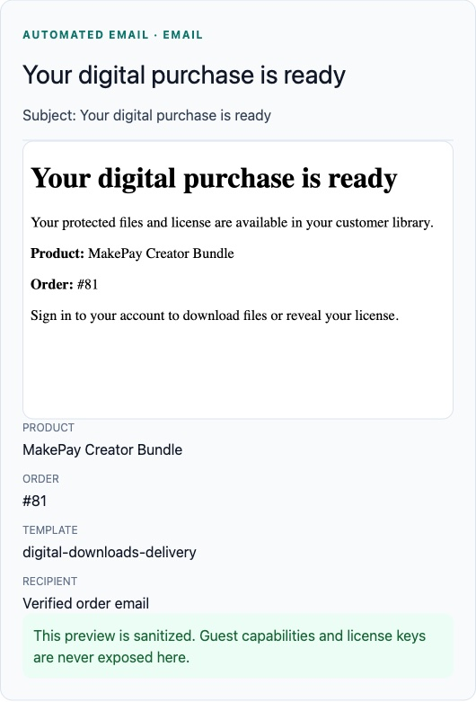

# Digital Downloads for Medusa

`@makecrypto/medusa-plugin-digital-downloads` adds a native Medusa v2 domain for
digital releases, protected files, durable purchase entitlements, download and
stream grants, and software licenses.

Medusa remains the source of truth for products, variants, prices, carts,
orders, customers, payment, tax, promotions, and fulfillment. The plugin links
digital configuration to those records instead of creating a second commerce
stack.

## Screenshots

### Digital Downloads overview



### Native Medusa product integration



### Product configuration and protected assets



### Customer downloads and licenses



### Buyer-controlled license reveal



### Digital delivery in native order history



### Automated post-purchase email



Email layout, branding, provider credentials, and transport remain owned by the
host application's Medusa Notification Module. The plugin supplies durable
delivery events, template data, retry state, and copy-ready provider/template
[examples](examples/notification-provider/README.md).

See the [Medusa Admin guide](docs/ADMIN_GUIDE.md) for the complete merchant
workflow and the [storefront guide](docs/STOREFRONT.md) for authenticated,
per-order, guest, download, and license integration.

## Architecture

The plugin domain is organized around:

- Medusa product/variant-linked digital configuration;
- immutable releases containing protected/preview assets, or a zero-asset
  license boundary backed by an enabled generated or pooled license policy;
- local private storage and private S3/S3-compatible storage;
- durable entitlements linked to Medusa orders, line items, and customers;
- opaque, short-lived asset grants separate from ownership;
- generated or imported license keys, assignments, activations, and audit
  records;
- idempotent fulfillment state and notification delivery records;
- supported Medusa Admin extensions and a typed Store API client;
- accessible, style-light React product-preview and customer-library
  primitives.

The package does not provide DRM, a hosted storefront, a replacement checkout,
or a payment provider. Public previews are separate from protected master
assets.

## Compatibility

- Node.js 20 or newer
- PostgreSQL through the Medusa host application
- `@medusajs/medusa`, Framework, Admin SDK, and icons `>=2.18 <3`
- `@medusajs/ui` `>=4 <5`
- React and React DOM `>=18.3.1 <20` for supplied storefront/Admin UI

The plugin is built and host-tested against Medusa 2.18 and runs source CI on
Node.js 20 and 22. Test the exact Medusa/plugin combination before production
upgrades.

## Install

Install from npm in the Medusa backend:

```bash
npm install @makecrypto/medusa-plugin-digital-downloads
```

For reproducible deployments, commit your lockfile or pin an approved version.
Verified tarballs, `.sha256` checksums, CycloneDX SBOMs, and build-provenance
attestations are available from
[GitHub Releases](https://github.com/makepay-apps/medusa-plugin-digital-downloads/releases).
Verify the selected channel and package integrity during every deployment; see
[RELEASE.md](RELEASE.md).

Register it in `medusa-config.ts`. This minimal local-storage example uses a
persistent directory outside any publicly served tree:

```ts
import { defineConfig } from "@medusajs/framework/utils"

export default defineConfig({
  plugins: [
    {
      resolve: "@makecrypto/medusa-plugin-digital-downloads",
      options: {
        encryptionKey: process.env.DIGITAL_DOWNLOADS_ENCRYPTION_KEY,
        tokenSecret: process.env.DIGITAL_DOWNLOADS_TOKEN_SECRET,
        storage: {
          defaultProvider: "local",
          local: {
            rootPath: process.env.DIGITAL_DOWNLOADS_LOCAL_ROOT,
            signingSecret:
              process.env.DIGITAL_DOWNLOADS_LOCAL_SIGNING_SECRET,
          },
        },
      },
    },
  ],
})
```

Generate independent secrets and store them in the deployment's secret
manager:

```bash
openssl rand -hex 32 # encryption key
openssl rand -hex 32 # token secret
openssl rand -hex 32 # local descriptor signing secret
```

The encryption key must be exactly 64 hexadecimal characters representing 32
random bytes. Generate it independently from the token secret; the plugin
rejects configurations where both values are identical. Token and local
signing secrets remain arbitrary UTF-8 values containing at least 32 bytes.

Keep `DIGITAL_DOWNLOADS_ENCRYPTION_KEY` stable. Existing encrypted license keys
cannot be recovered after it is lost or replaced without a supported
re-encryption migration.

Apply the packaged module migrations from the Medusa application:

```bash
npx medusa db:migrate
```

Then restart the Medusa API and worker processes. See
[docs/CONFIGURATION.md](docs/CONFIGURATION.md) for complete local and S3
examples and [docs/MIGRATIONS.md](docs/MIGRATIONS.md) before a production
upgrade.

## S3-compatible storage

Choose S3 as the default provider and supply a private bucket:

```ts
{
  resolve: "@makecrypto/medusa-plugin-digital-downloads",
  options: {
    encryptionKey: process.env.DIGITAL_DOWNLOADS_ENCRYPTION_KEY,
    tokenSecret: process.env.DIGITAL_DOWNLOADS_TOKEN_SECRET,
    storage: {
      defaultProvider: "s3",
      s3: {
        bucket: process.env.DIGITAL_DOWNLOADS_S3_BUCKET!,
        region: process.env.DIGITAL_DOWNLOADS_S3_REGION || "us-east-1",
        endpoint: process.env.DIGITAL_DOWNLOADS_S3_ENDPOINT,
        accessKeyId: process.env.DIGITAL_DOWNLOADS_S3_ACCESS_KEY_ID!,
        secretAccessKey:
          process.env.DIGITAL_DOWNLOADS_S3_SECRET_ACCESS_KEY!,
        sessionToken: process.env.DIGITAL_DOWNLOADS_S3_SESSION_TOKEN,
        prefix: process.env.DIGITAL_DOWNLOADS_S3_PREFIX || "digital-downloads",
        forcePathStyle:
          process.env.DIGITAL_DOWNLOADS_S3_FORCE_PATH_STYLE === "true",
      },
    },
  },
}
```

The bucket must not be public. Restrict credentials to the configured bucket
and prefix. Use HTTPS; insecure endpoints are intended only for deliberate
local MinIO-style development.

## Merchant workflow

After the plugin and migrations are installed, its Medusa Admin extensions are
the merchant entry point. The intended flow is:

1. Select a Medusa product and variants.
2. Create digital configuration and a draft release.
3. Upload protected assets and add explicitly public previews. A license-only
   release may have an empty asset set when it has an enabled generated or
   pooled license policy.
4. Configure delivery limits and an optional license policy.
5. Publish a ready release.
6. Complete checkout using normal Medusa storefront/payment behavior.
7. Inspect issued entitlements on the order or in Digital Downloads Admin.
8. Revoke, reissue, or investigate access through audited actions.

Every digital product, including a license-only product, requires a current
published release before fulfillment. Download, stream, and mixed releases
must contain the ready deliverables required by their delivery type;
license-only releases may publish with zero assets when an enabled generated
or pooled license policy supplies the deliverable. Publishing with
`notify_existing_customers: true` is intentionally unsupported until explicit
entitlement update-policy semantics ship; use the default `false` value.

The exact Admin surfaces available in the installed build are documented in
[docs/ADMIN_GUIDE.md](docs/ADMIN_GUIDE.md).

## Entitlement lifecycle

Each digital configuration chooses when fulfillment becomes eligible:

- `payment_captured` waits for Medusa's captured-payment state/event;
- `order_completed` waits for the order-completed state/event;
- `manual` waits for the authenticated Admin order-issue action;
- configurations created without an explicit strategy use `order.placed`.

The placed, completed, and captured subscribers converge on the same durable
fulfillment operation. A five-minute reconciliation job retries pending,
failed, or stale leased work. Order cancellation, payment refund, and
chargeback/dispute subscribers apply the configured revocation policy. When
the host configures an email provider and the documented templates, delivery
notifications use a durable outbox and a separate two-minute retry job. Email
failure never rolls back ownership.

Order issuance and order-wide revocation share one order lock. A selected
refund/revocation commits every entitlement state change, capability/license
invalidation, and its notification outbox rows in one transaction. Reissuing
an expired entitlement renews its recorded purchase term by default (or uses
an explicit replacement deadline) so the restored `active` state is usable.
The hourly expiry job also scans a separately bounded terminal batch and
atomically repairs missing expiry/revocation outboxes from legacy or interrupted
lifecycle writes. It rechecks status and deadlines under the entitlement lock.

The optional zero-cost Digital delivery Fulfillment Module provider can expose
digital delivery in Medusa's native fulfillment UI. It does not issue
entitlements itself and does not replace the event subscribers or cart
completion. Registration and refund-policy details are in
[docs/CONFIGURATION.md](docs/CONFIGURATION.md).

## Storefront

The optional storefront export provides a Fetch transport, a Medusa SDK
adapter, TypeScript response types, hooks, and accessible React primitives:

```ts
import {
  createDigitalDownloadsFetchClient,
} from "@makecrypto/medusa-plugin-digital-downloads/storefront"

const digitalDownloads = createDigitalDownloadsFetchClient({
  baseUrl: process.env.NEXT_PUBLIC_MEDUSA_BACKEND_URL!,
  publishableKey: process.env.NEXT_PUBLIC_MEDUSA_PUBLISHABLE_KEY,
  authToken: async () => getCustomerToken(),
  credentials: "include",
})
```

See [docs/STOREFRONT.md](docs/STOREFRONT.md) for customer/guest authentication,
React examples, grant handling, and security guidance. See
[docs/API.md](docs/API.md) for the backend contract.

Use `DigitalLibrary` for the authenticated account-wide purchase library and
`DigitalOrderDownloads` inside Medusa's native customer order-detail view. Both
surface protected files and buyer-controlled license reveal without replacing
the host's account, checkout, or order-history implementation.

React customer resources require a changing, non-secret `identityKey` so
cached state cannot cross a login/account boundary. Guest flows send
`{ token, email? }`; order-email matching is enabled by default, so storefronts
should prompt for the order email and send it as `email` on access/grants and
`guest_email` on guest license reveal. The guest purchase capability lifetime
is configured separately from short-lived content grants and defaults to about
30 days. The built-in browser opener is a convenience for safe content up to
64 MiB; use the streaming BFF pattern for larger or seekable assets.

## MakePay interoperability

Digital Downloads is payment-provider agnostic. It works alongside the
separate `@makecrypto/medusa-plugin-makepay` payment provider because both use
normal Medusa payment/order lifecycle events:

- configure MakePay under Medusa's Payment Module;
- configure MakePay credentials only in that provider;
- redirect the buyer to MakePay's hosted checkout from the normal Medusa
  payment session;
- let the signed MakePay webhook update Medusa payment state;
- let Digital Downloads issue ownership from the configured Medusa lifecycle
  signal.

Do not pass MakePay API or webhook secrets to Digital Downloads. The two
packages have no secret-sharing or direct runtime dependency.

## Security baseline

- Store protected files outside public web roots and keep S3 buckets private.
- Never log or persist plaintext download/guest capabilities.
- Never expose local paths, S3 keys, credentials, token hashes, or encrypted
  license values through Store API projections.
- Use HTTPS for the Medusa backend, storefront, and object storage.
- Configure a stable privacy salt and distributed rate limiting for a
  multi-instance production deployment where supported.
- Back up PostgreSQL, protected objects, configuration, and encryption material
  as separate recovery layers.
- Test customer-versus-customer, guest, refund, expiry, revocation, duplicate
  event, and byte-range edge cases before launch.

Report vulnerabilities privately using [SECURITY.md](SECURITY.md).

## Documentation

- [Configuration](docs/CONFIGURATION.md)
- [Admin guide](docs/ADMIN_GUIDE.md)
- [Storefront integration](docs/STOREFRONT.md)
- [API reference](docs/API.md)
- [Migrations and rollback](docs/MIGRATIONS.md)
- [Architecture](docs/ARCHITECTURE.md)
- [Testing strategy](docs/TESTING.md)
- [Product scope and roadmap](docs/V1_PLAN.md)
- [Contributing](CONTRIBUTING.md)
- [Release process](RELEASE.md)

## Development

```bash
npm ci
npm run lint
npm run typecheck
npm run test:unit
npm run build
npm run pack:dry-run
```

PostgreSQL integration commands and local plugin-development instructions are
in [CONTRIBUTING.md](CONTRIBUTING.md).

## License

MIT. See [LICENSE](LICENSE).

<p align="center">
  <a href="https://makepay.io" rel="noopener noreferrer">Brought to you by MakePay.io — crypto payment gateway.</a>
</p>
