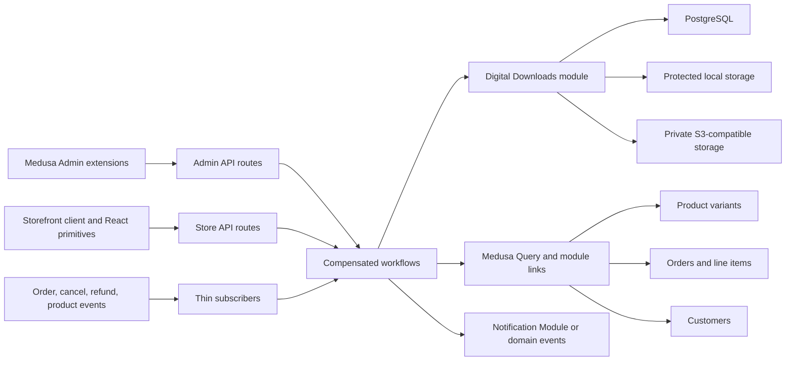
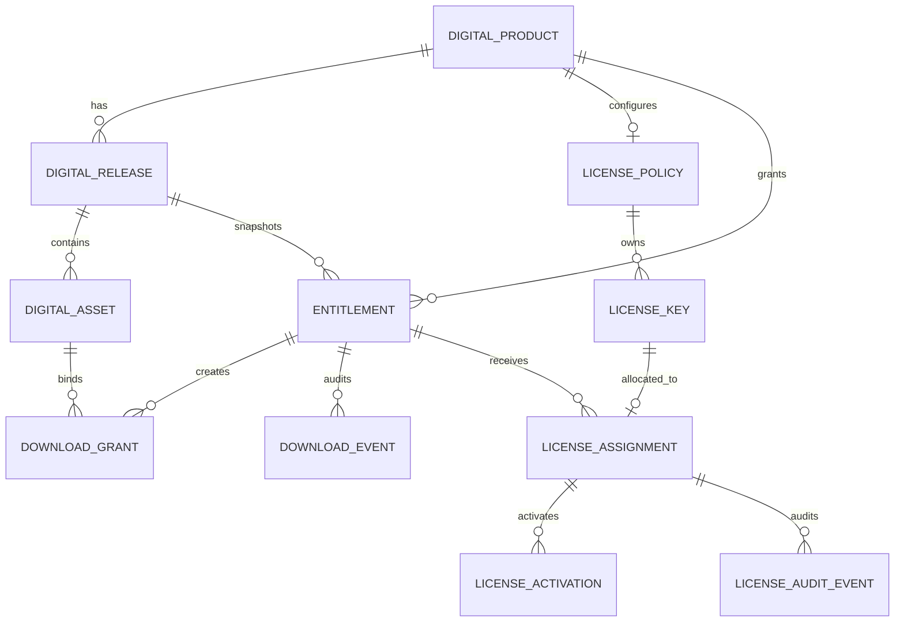

# Architecture

## System shape

The package is a Medusa v2 plugin containing one isolated domain module plus
supported Medusa extension surfaces.



The plugin never replaces Medusa's product, cart, checkout, payment, order,
customer, notification, or Admin systems. Module links provide graph traversal
while keeping the custom module isolated.

The Admin shell and supplied storefront primitives include a small fixed
MakePay.io attribution. It is presentation-only: it receives no customer,
order, analytics, or payment data and does not couple this plugin to the MakePay
payment provider.

## Domain model



Cross-module links associate:

- `DigitalProduct` with one Product Module `ProductVariant`;
- `Entitlement` with its Order Module `Order`;
- `Entitlement` with a Customer Module `Customer` when the order has one.

Opaque order, line-item, variant, and customer snapshots may also be persisted as
non-relational values to enforce natural idempotency and preserve historical
support context. They do not become database foreign keys into another module.

## Core records

### DigitalProduct

Variant-level delivery policy and display metadata. It defines product type,
delivery mode, publication state, default limits, access/update policy, and its
current published release. Product title, description, price, currency, sales
channels, tax, and normal catalog state remain in Medusa's Product Module.

### DigitalRelease

An immutable version boundary. Draft releases may be edited; publication fixes
the release identity used in purchase snapshots. Superseding a release does not
rewrite existing entitlements. The update policy decides whether an entitlement
can also see newer releases.

### DigitalAsset

Metadata for a protected master or public preview. Storage locations never
appear in Store API projections. An asset records its driver, opaque storage
key, filename, MIME type, bytes, SHA-256 checksum, purpose, delivery mode, sort
order, and optional media metadata.

### Entitlement

Durable ownership independent from a download URL. Its natural key is the
Medusa order line plus a deterministic unit index or a documented quantity
aggregation. It snapshots product, variant, release, assets, license terms,
customer/guest context, limits, and policy at purchase. Revoking a link does not
delete ownership history.

### DownloadGrant and DownloadEvent

A grant is a short-lived capability bound to exactly one entitlement and asset.
The database stores a SHA-256 token hash, expiry, use state, and optional hashed
IP binding. Download events are sanitized audit records. Range continuation uses
the same grant and must not increment the entitlement's logical download count
for every byte range.

### LicensePolicy, LicenseKey, LicenseAssignment, and LicenseActivation

A policy selects generated or imported keys, pattern, validity, and activation
rules. A recoverable key is encrypted using AES-256-GCM and separately indexed
by a normalized SHA-256 hash. Allocation is transactional and idempotent.
Activations use normalized instance hashes rather than raw machine identifiers.

### Settings

Database-managed merchant defaults that are safe for Admin display. Runtime
secrets and environment topology remain plugin options/environment variables.
Write-only secret replacement fields must never be returned by an Admin GET.

## Plugin options

```ts
type DigitalDownloadsPluginOptions = {
  encryptionKey: string
  storage?:
    | {
        driver: "local"
        root: string
      }
    | {
        driver: "s3"
        bucket: string
        region: string
        endpoint?: string
        accessKeyId: string
        secretAccessKey: string
        forcePathStyle?: boolean
        prefix?: string
      }
  publicBaseUrl?: string
  maxUploadBytes?: number
  allowedMimeTypes?: string[]
  trustProxy?: boolean
}
```

`encryptionKey` is a 32-byte key encoded as 64 hexadecimal characters. Local
storage defaults to a persistent directory beneath the Medusa application data
directory, never `static` or another publicly served directory. Production
documentation recommends explicit configuration.

## Purchase lifecycle

1. Medusa completes a normal cart and emits `order.placed`.
2. A thin subscriber runs the issuance workflow with the order ID.
3. The workflow queries order items and linked Digital Products.
4. For each digital line/unit it derives a stable natural key.
5. Existing entitlements are reused; missing entitlements are created with an
   immutable purchase snapshot.
6. Generated or pool license assignment occurs within the same idempotent flow.
7. Module links connect ownership to the order and optional customer.
8. A domain event is emitted after commit for notification and analytics.
9. A retry at any point observes natural keys and resumes without duplicate
   ownership, downloads, or license keys.

The plugin deliberately does not add a custom cart-completion route. MakePay or
another provider remains responsible for payment status. Store policy controls
whether `order.placed` authorization is enough or a later captured/paid signal
is required.

## Access lifecycle

1. An authenticated customer lists only entitlements linked to their actor ID.
   A guest presents a high-entropy capability delivered out of band.
2. Requesting a download validates entitlement state, expiry, release access,
   asset membership, delivery mode, logical count, and optional IP policy.
3. The server creates a short-lived grant and returns the same-origin protected
   content route. Version 1 never returns a presigned S3 `GET`; presigned URLs
   are upload-only.
4. The protected route streams local content from a canonical path below the
   configured root or S3 content from a key below the configured prefix. This
   proxy boundary pipes a Node `Readable` with backpressure and enforces
   transfer completion/failure accounting and range continuation policy for
   both providers without buffering the response body.
5. After authorization and storage-open checks succeed, the route atomically
   consumes the grant and increments the entitlement count before setting
   response headers or writing the first body byte. An accounting failure
   therefore exposes no protected bytes. Once committed, the source streams
   directly with backpressure; a disconnect or late source failure remains
   counted and records transfer failure/observed bytes. Ranges on the same grant
   continue the same delivery session without a visibility race.
6. Revocation, refund, suspension, expiry, or limit exhaustion invalidates
   future grants immediately.

Ingress/completion and publication verify SHA-256 before an asset becomes an
immutable deliverable. The read path validates the returned size, range,
status, and publication-manifest metadata without buffering a whole object for
a second hash.

## Security invariants

1. Persistence entities are never serialized directly to Store clients.
2. Authorization starts from the requesting actor/capability and traverses to
   the requested resource; it never starts from a user-supplied asset ID alone.
3. Every bearer value has at least 256 bits of CSPRNG entropy and is looked up by
   a hash. Recoverable values use authenticated encryption.
4. Timing-safe comparison is used when comparing secrets or signatures.
5. Master files use protected local paths or private object keys. Public preview
   status is explicit and cannot be inferred from a filename.
6. Canonical local paths must remain beneath the configured root. User input is
   never concatenated into a filesystem path or S3 credential scope.
7. Store responses containing a capability or license use `private, no-store`,
   omit referrers where applicable, and do not place secrets in query strings.
8. Logs and audit events omit raw email where avoidable, full IP, tokens,
   license keys, encryption material, storage keys, and credentials.
9. Download and activation limits are enforced atomically under concurrency.
10. Duplicate commerce events and workflow retries are safe by construction.
11. Catalog edits cannot mutate a purchase snapshot or redirect a historical
    entitlement to attacker-selected content.
12. Refund/cancellation behavior is explicit, configurable, audited, and
    idempotent; it is never silently ignored.

## API boundaries

- `/admin/digital-downloads/**`: authenticated Medusa Admin actor, validated
  mutations, paginated safe projections, and explicit destructive actions.
- `/store/digital-downloads/previews/**`: public preview-only metadata/content.
- `/store/digital-downloads/me/**`: authenticated Medusa customer ownership.
- `/store/digital-downloads/guest/**`: guest capability ownership.
- `/store/digital-downloads/content/**`: short-lived grant validation and
  protected stream/download delivery.
- `/store/digital-downloads/licenses/**`: reveal/validate/activate/deactivate and
  heartbeat with bounded inputs and rate limiting.

The OpenAPI document is normative for status codes and schemas; implementation
tests assert authorization and no-store behavior separately.

## Compatibility strategy

- Develop and run the complete suite against Medusa 2.18.
- Keep runtime peer dependencies at the tested version 1 baseline,
  `>=2.18 <3`. Lower the minimum only after a compatibility CI lane proves an
  older host version.
- Use only documented plugin/module/Admin extension APIs.
- Reuse Medusa core workflows and Query in orchestration, but keep pure domain
  logic and storage behind the plugin module service.
- Package from `medusa plugin:build` output and validate the installed tarball,
  not only the source checkout.
